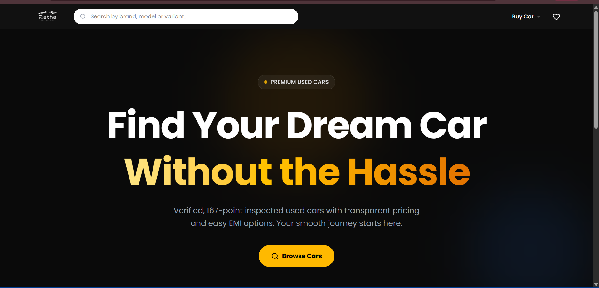

# Ratha Frontend

Ratha is a premium used car marketplace web application built with Next.js. It provides users with a seamless experience to find, compare, and purchase verified, 167-point inspected used cars with transparent pricing and easy EMI options.

## 🌐 Live Preview

[](https://ratha.nidhieeeee.codes/)

Click the button above to view the live project.



## 📹 Video Demonstrations

Watch the walkthrough of the project:

- [Part 1: Overview and Features](https://www.loom.com/share/9b6900cfac88479399f0c6ebc2dec409)
- [Part 2: Car Searching and Filtering](https://www.loom.com/share/9c8182174aab4a7283c9dc88f032420e)
- [Part 3: Car Comparison and Details](https://www.loom.com/share/d038ac5edb3e4ff7a014ee75dbb2fc19)

## 🚀 Features

- **Premium UI/UX:** A modern, responsive design featuring a dark-themed hero section and clean, light-themed car listings.
- **Advanced Car Search & Filtering:** Browse cars with comprehensive filtering (brand, fuel type, transmission, price) and sorting capabilities.
- **Ratha Assured:** Every car is 167-point inspected, ensuring quality and reliability.
- **Car Comparison:** Select up to 5 cars to compare their features, prices, and specifications side-by-side.
- **Detailed Car Information:** View comprehensive details for each car, including discount pricing, EMI options, kilometer driven, and ownership history.
- **Performant & SEO Optimized:** Built with Next.js App Router for server-side rendering, optimized loading, and excellent SEO.

## 🛠 Tech Stack

- **Framework:** [Next.js](https://nextjs.org/) (App Router, Server Components)
- **Library:** [React 19](https://react.dev/)
- **Styling:** [Tailwind CSS v4](https://tailwindcss.com/)
- **UI Components:** [Shadcn UI](https://ui.shadcn.com/), [Base UI](https://base-ui.com/)
- **Icons:** [Lucide React](https://lucide.dev/)
- **Animations:** [Framer Motion](https://www.framer.com/motion/), [tw-animate-css](https://github.com/ikcb/tw-animate-css)
- **Data Fetching:** Axios

## 📦 Getting Started

### Prerequisites

Ensure you have Node.js installed (v18.17.0 or higher recommended).

### Installation

1. Clone the repository:
   ```bash
   git clone <repository-url>
   cd ratha-frontend
   ```

2. Install dependencies:
   ```bash
   npm install
   # or
   yarn install
   # or
   pnpm install
   ```

3. Set up environment variables:
   Create a `.env.local` file in the root directory and configure the required variables (e.g., API endpoints).

### Running the Development Server

Start the development server:

```bash
npm run dev
# or
yarn dev
# or
pnpm dev
```

Open [http://localhost:3000](http://localhost:3000) with your browser to see the application.

## 📁 Project Structure

- `src/app/`: Next.js App Router pages and layouts.
  - `page.js`: The landing page with hero and featured cars.
  - `cars/page.js`: The main car listing and search page.
- `src/components/`: Reusable React components.
  - `cars/`: Components related to car display (e.g., `CarCard.jsx`, `CarsListing.jsx`).
  - `common/`: Shared UI components like `Navbar.jsx`.
- `src/services/`: API integration and data fetching logic.
- `src/context/`: React context providers for state sharing.

## 🏛 Architecture

The frontend is architected using the modern Next.js App Router paradigm to ensure high performance, SEO friendliness, and a scalable codebase:

- **Next.js App Router (`src/app`)**: Utilizes server components by default for optimized page loads and excellent SEO, pushing rendering work to the server where possible. Client components are used specifically where interactivity is required.
- **Component-Driven Design (`src/components`)**: Reusable UI elements are modularized. The application blends custom components with accessible, unstyled primitives from **Base UI** and styled blocks from **Shadcn UI**.
- **Styling (`Tailwind CSS v4`)**: Utility-first CSS framework is used for rapid, responsive UI development.
- **State Management & Context (`src/context`)**: React Context API is employed to manage global states (like filter selections or comparison lists) without excessive prop drilling.
- **API & Data Fetching (`src/services`)**: **Axios** is used for client-side API requests. Data fetching logic is encapsulated within service modules to separate concerns from UI components.

## 🚀 Deployment

The easiest way to deploy your Next.js app is to use the [Vercel Platform](https://vercel.com/new) from the creators of Next.js. Check out the [Next.js deployment documentation](https://nextjs.org/docs/app/building-your-application/deploying) for more details.

## 🤝 Contributing

Contributions, issues, and feature requests are welcome! Feel free to check the issues page.
